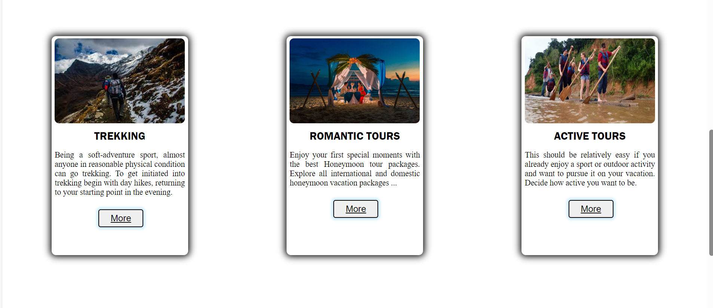

#Concept:

        ##A travel planner can also refer to a professional travel agent or consultant who assists in creating an itinerary based on the traveler's preferences and needs. In essence, a travel planner simplifies the travel process and makes it more enjoyable and stress-free for the traveler.

---
        ##Best travel Package For You
        Travel package pages added 6 category page added.

        1. AFRICAN SAFARI
        2. SUMMER
        3. CITY TOURS
        4. TREKKING
        5. ROMANTIC TOURS
        6. ACTIVE TOURS

   

---
#How to contribute in 

 We welcome contributions from the community to help us expand and improve this handbook. If you would like to contribute, follow these steps:

1. Forking a repository.
2. Cloning a fok
3. Copy the URL for the repository.

4. To clone the repository using HTTPS, under       "HTTPS", click.

5. To clone the repository using an SSH key, including a certificate issued by your organization's SSH certificate authority, click SSH, then click.

6. To clone a repository using GitHub CLI, click GitHub CLI, then click.

7. Open Terminal.
8. Changes the current working directory to the location where you want the cloned directory.
9. type git clone, and the pase URL copied earlier. It will look like this, with your GitHub username instead of YOUR USERNAME:
   git clone url past.
10. press Enter your local cone will be created.
11. Creating aa branch to work on.
12. Making and pushing changes:\n

    first command are use: `git add .`\n

    second command are use: `git commit -m "a short desc of the changes"`\n

    third command are user: `git push`

13. Open the Github acc and making the pull requrest.

    ---

Made with [contrib.rocks](https://contrib.rocks).

